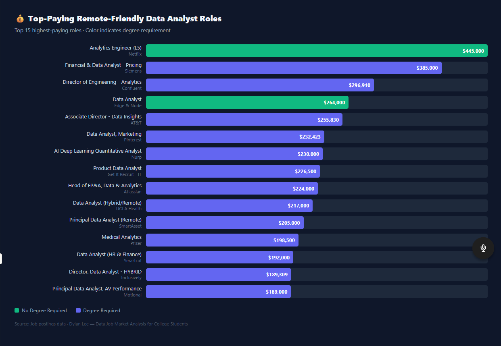
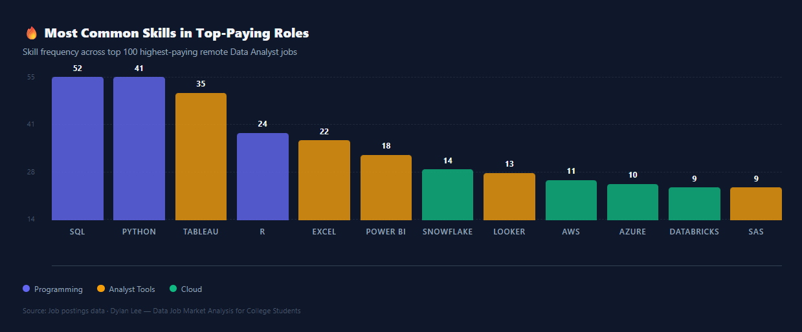

# Introduction
🎓 Built for college students breaking into data analytics! This project dives into the data analyst job market with one goal: helping students figure out where to focus their time and energy before they graduate. By analyzing real job postings, this project uncovers 💰 which remote roles pay the most, 🔥 which skills employers actually ask for at the entry/associate/junior level, and 📈 where high demand meets high salary so students can learn smarter, not harder.

🔍 SQL queries? Check them out here: [project_sql folder](/project_sql/)

# Background
As a college student studying Information Management and Technology, I wanted to go beyond generic career advice like "learn SQL and Python." This project analyzes real job postings to answer a more specific question: what do entry-level Data Analyst roles actually require, and what do they pay?

The dataset comes from Luke Barousse's SQL Course and contains job titles, salaries, locations, and required skills. Unlike most similar projects, I filtered specifically for entry-level, associate, and junior Data Analyst roles — making this analysis directly relevant to college students preparing to enter the data analytics field.

### The questions I wanted to answer through my SQL queries were: 

1. top_paying_jobs.sql → What are the top 100 highest-paying remote-friendly Data Analyst jobs, what skills do they require, and do they offer benefits or waive degree requirements?

2. top_demanded_skills.sql → Which skills appear most frequently in entry-level, associate, and junior Data Analyst postings — and how do they split between remote and on-site roles?

3. top_paying_skills.sql → Among entry-level and associate Data Analyst roles, which skills are associated with the highest average salaries?

4. optimal_skills.sql → What are the most optimal skills to learn — balancing high demand AND high salary — ranked by a student-friendly verdict label?

# Tools I Used
For my deep dive into the data analyst job market, I harnessed the power of several key tools:

- **SQL:** The backbone of my analysis, allowing me to query the database and unearth critical insights.
- **PostgreSQL:** The chosen database management system, ideal for handling the job posting data.
- **Visual Studio Code:** My go-to for database management and executing SQL queries.
- **Git & GitHub:** Essential for version control and sharing my SQL scripts and analysis, ensuring collaboration and project tracking.

# The Analysis
Each query targets a specific question college students face when entering the data analytics job market. Here's how I approached each one:

### 1. Top Paying Data Analyst Jobs
To identify the **highest-paying Data Analyst roles**, I created a query that selects the **top 100 jobs by average yearly salary** and connects them to the skills required for each position.

The query first uses a **CTE (`top_paying_jobs`)** to filter roles with salary data and rank them from highest to lowest pay. It also adds useful context such as **work location (Remote vs On-Site), degree requirements, and health insurance availability**.

Finally, the query joins the skills tables and uses **`STRING_AGG`** to combine multiple skills into a single row per job, creating a cleaner dataset that is easier to analyze.


```sql
WITH top_paying_jobs AS (
    SELECT
        job_postings_fact.job_id,
        job_postings_fact.job_title,
        job_postings_fact.job_schedule_type,
        CASE
            WHEN job_postings_fact.job_work_from_home = TRUE THEN 'Remote'
            ELSE 'On-Site'
        END AS work_location_type,
        CASE
            WHEN job_postings_fact.job_no_degree_mention = TRUE THEN 'No Degree Required'
            ELSE 'Degree Required'
        END AS degree_requirement,
        CASE
            WHEN job_postings_fact.job_health_insurance = TRUE THEN 'Yes'
            ELSE 'No'
        END AS health_insurance,
        job_postings_fact.job_posted_date::DATE AS date_posted,
        job_postings_fact.salary_year_avg,
        company_dim.name AS company_name
    FROM
        job_postings_fact
        LEFT JOIN company_dim ON job_postings_fact.company_id = company_dim.company_id
    WHERE
        job_postings_fact.job_title_short = 'Data Analyst'
        AND job_postings_fact.salary_year_avg IS NOT NULL
        AND (
            job_postings_fact.job_work_from_home = TRUE
            OR job_postings_fact.job_location    = 'Anywhere'
        )
    ORDER BY
        job_postings_fact.salary_year_avg DESC
    LIMIT 100
)
SELECT
    top_paying_jobs.job_id,
    top_paying_jobs.company_name,
    top_paying_jobs.job_title,
    top_paying_jobs.job_schedule_type,
    top_paying_jobs.work_location_type,
    top_paying_jobs.degree_requirement,
    top_paying_jobs.health_insurance,
    top_paying_jobs.date_posted,
    top_paying_jobs.salary_year_avg,
    STRING_AGG(skills_dim.skills, ', ' ORDER BY skills_dim.skills)  AS skills,
    STRING_AGG(DISTINCT skills_dim.type, ', ')                       AS skill_categories
FROM
    top_paying_jobs
    INNER JOIN skills_job_dim ON top_paying_jobs.job_id  = skills_job_dim.job_id
    INNER JOIN skills_dim     ON skills_job_dim.skill_id = skills_dim.skill_id
GROUP BY
    top_paying_jobs.job_id,
    top_paying_jobs.company_name,
    top_paying_jobs.job_title,
    top_paying_jobs.job_schedule_type,
    top_paying_jobs.work_location_type,
    top_paying_jobs.degree_requirement,
    top_paying_jobs.health_insurance,
    top_paying_jobs.date_posted,
    top_paying_jobs.salary_year_avg
ORDER BY
    top_paying_jobs.salary_year_avg DESC;
```
## Key Insights from the Top-Paying Data Analyst Jobs (2023–2025)

### Salary Distribution of Top Jobs

The highest-paying Data Analyst positions exceed $180K+ annually, showing that analytics roles can reach compensation levels comparable to other advanced technical careers.



*Bar chart showing the highest salaries among the top Data Analyst roles.*


### Most Common Skills in Top Paying Roles

High-paying jobs frequently require SQL, Python, and data visualization tools, reinforcing that strong technical and analytical skills are essential for higher salaries.



*Bar chart showing the most common skills required in the top-paying Data Analyst roles.*

### Work Location Distribution (Top 100 Jobs)

| Work Location | Count | Percentage |
|---------------|-------|-----------|
| Remote        | 87    | 98.9%     |
| On-Site       | 1     | 1.1%      |

> The single On-Site result is AT&T's "Lead Data Analysis" role at $148,500. Every other role in the top 100 is remote.

---

### Degree Requirement (Top 100 Jobs)

| Degree Requirement | Count | Percentage |
|-------------------|-------|-----------|
| Degree Required    | 67    | 76%       |
| No Degree Required | 21    | 24%       |

> Notable companies offering high-paying roles without a degree requirement include:
> - Netflix ($445K)  
> - Edge & Node ($264K)  
> - SimplePractice ($172.5K)  
> - Zscaler ($152.6K)  
> - Rocket Money ($152.5K)  
> - ServiceNow ($164K)  

---

### Key Takeaway for Students

While **76%** of top-paying roles mention a degree requirement, **1 in 4 high-paying remote Data Analyst jobs does not** — and some of those no-degree roles are among the highest paying in the dataset.  

This directly supports **finishing your degree while also building a strong skill portfolio**, since skills clearly matter even at the highest salary levels.
