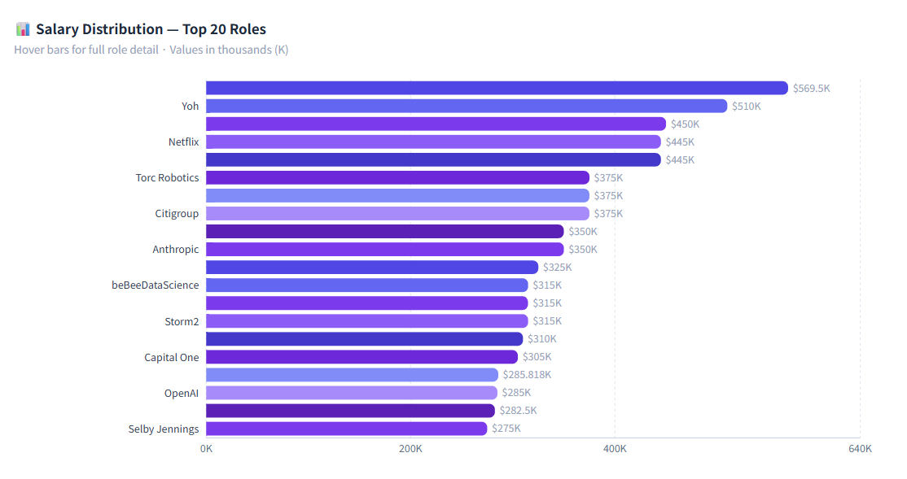
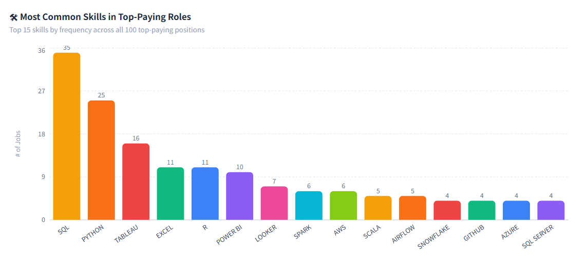
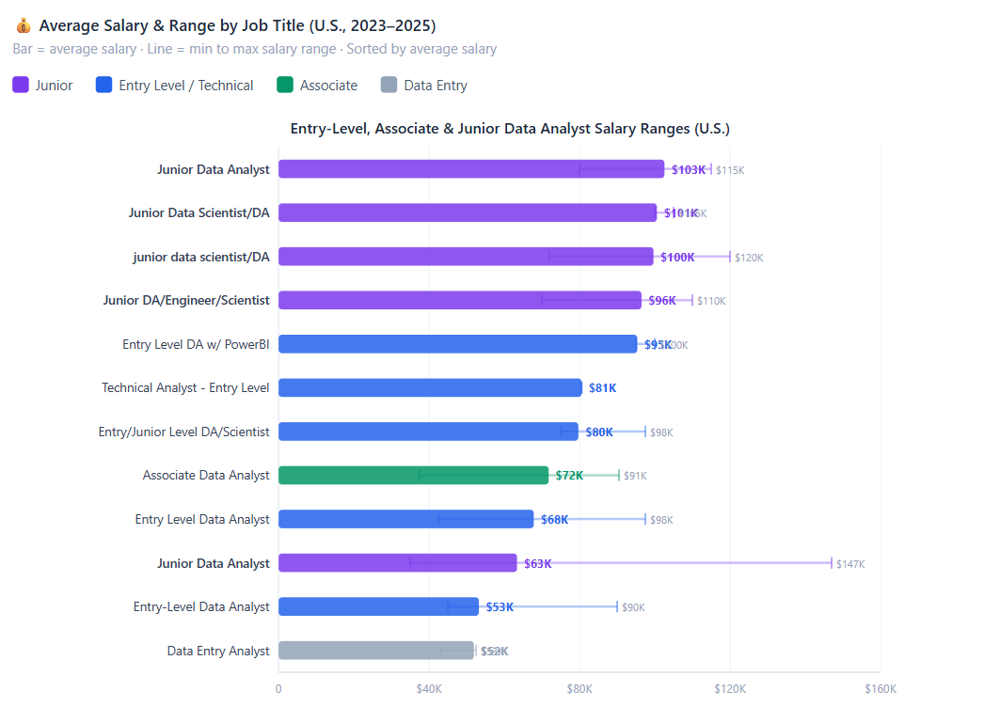
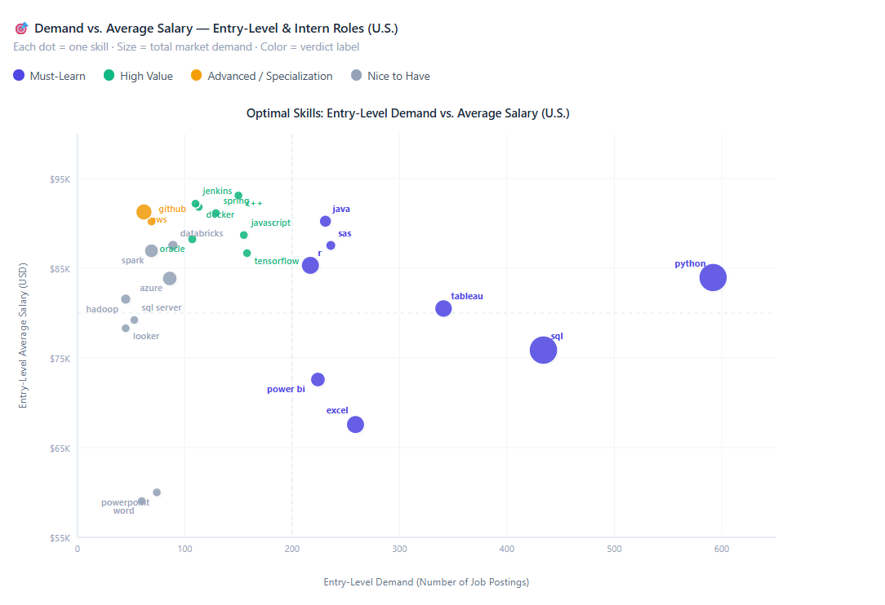

# Introduction
This project uses SQL to examine thousands of job postings and investigate the actual data analytics job market. The aim is straightforward: to assist students in knowing what skills really matter, what roles are the most lucrative, and where to specialize in their learning before they graduate.

Through the study of real-world job listings, this project will reveal:

1. Which Data Analyst positions in the U.S. pay the highest salaries.
2. Which skills appear most frequently in analytics job postings worldwide.
3. The skills that balance high demand and strong salaries.
4. The kind of entry-level and junior roles currently required in today's job market.

Instead of blanket advice such as “learn SQL and Python,” this analysis relies on real job data to identify the most effective skills and job paths for data professionals who want to build a more impactful career.

🔍 SQL queries used in this project can be found here: [project_sql folder](/project_sql/)

📊 Dataset: 2023–2025 Data Science Job Postings  
(Source: Luke Barousse SQL Course)

# Background

As I am in college, studying Information Management and Technology, I wanted to do more than give one-size-fits-all career advice such as “learn SQL and Python.” Instead of following broad recommendations, this project analyzes real job postings to answer a more real-world question: **what skills do Data Analyst roles actually require, and how much are they paid?**

The dataset was extracted from Luke Barousse’s SQL Course and contains job titles, salary data, job locations, and technical requirements. With SQL, I looked into this dataset to uncover substantive themes in the data analytics job market.

While many related projects often only list common skills, this analysis looks specifically at **salary, demand, and entry level opportunities** so that students entering the field can distinguish which skills provide the best competitive advantage.

### Questions Explored in This Project

The analysis is organized into four SQL investigations, each designed to answer a specific career focused question.

1. **top_paying_job_skills.sql**
   Identifies the **100 highest paying Data Analyst roles in the United States**, including required skills, work location type, degree expectations, and whether companies offer health insurance.

2. **top_demanded_skills.sql**
   Determines the **five most frequently requested skills in Data Analyst job postings worldwide**, providing a global view of core industry requirements.

3. **different_level_job_skills.sql**
   Examines **entry level, associate, and junior Data Analyst roles in the United States**, comparing salary ranges, job demand, and required skills for each title.

4. **most_optimal_skills.sql**
   Identifies the **most valuable skills for students to learn** by balancing entry level demand with salary potential and assigning a clear verdict label for each skill.


# Tools I Used
For my deep dive into the data analyst job market, I harnessed the power of several key tools:

- **SQL:** The backbone of my analysis, allowing me to query the database and unearth critical insights.
- **PostgreSQL:** The chosen database management system, ideal for handling the job posting data.
- **Visual Studio Code:** My go-to for database management and executing SQL queries.
- **Git & GitHub:** Essential for version control and sharing my SQL scripts and analysis, ensuring collaboration and project tracking.

# The Analysis

Each SQL query in this project investigates a specific question students often have when preparing for a career in data analytics. By analyzing real job posting data, the queries reveal patterns in salary, required skills, job demand, and role expectations across the data analytics job market.

The following sections explain the approach and insights generated from each analysis.

## 1. Top Paying Data Analyst Jobs with Required Skills in the United States (2023 to 2025)

Identify the Data Analyst positions with the highest pay in the United States and analyze the important factors associated with these positions. This query analyzes data from **2023 to 2025** to provide insights about some critical aspects related to high salary spots. In particular, the analysis explores:

- Technical skills needed per top-paying position.
- Type of work location — whether remote or on site.
- If a degree is required or not explicitly mentioned.
- Access to benefits of health insurance.
- Salaries for the top paid roles.

This query provides the users with a very clear image of **what companies expect from candidates applying for the most competitive Data Analyst positions in the U.S.** by combining salary data with job requirements and skill information.


```sql
WITH top_paying_jobs AS (
    SELECT DISTINCT ON (company_dim.name, job_postings_fact.job_title)
        job_postings_fact.job_id,
        job_postings_fact.job_title,
        job_postings_fact.job_schedule_type,
        CASE
            WHEN job_postings_fact.job_work_from_home = TRUE THEN 'Remote'
            ELSE 'On-Site'
        END AS work_location_type,
        CASE
            WHEN job_postings_fact.job_no_degree_mention = TRUE THEN 'No Degree Required'
            ELSE 'Degree Required'
        END AS degree_requirement,
        CASE
            WHEN job_postings_fact.job_health_insurance = TRUE THEN 'Yes'
            ELSE 'No'
        END AS health_insurance,
        job_postings_fact.job_posted_date::DATE AS date_posted,
        job_postings_fact.salary_year_avg,
        company_dim.name AS company_name

    FROM
        job_postings_fact
        LEFT JOIN company_dim
            ON job_postings_fact.company_id = company_dim.company_id

    WHERE
        job_postings_fact.job_title_short = 'Data Analyst'
        AND job_postings_fact.salary_year_avg IS NOT NULL
        AND job_postings_fact.job_country = 'United States'

    ORDER BY
        company_dim.name,
        job_postings_fact.job_title,
        job_postings_fact.job_posted_date DESC
)

SELECT
    top_paying_jobs.job_id,
    top_paying_jobs.company_name,
    top_paying_jobs.job_title,
    top_paying_jobs.job_schedule_type,
    top_paying_jobs.work_location_type,
    top_paying_jobs.degree_requirement,
    top_paying_jobs.health_insurance,
    top_paying_jobs.date_posted,
    top_paying_jobs.salary_year_avg,

    STRING_AGG(DISTINCT skills_dim.skills, ', ' ORDER BY skills_dim.skills) AS skills,
    STRING_AGG(DISTINCT skills_dim.type, ', ') AS skill_categories

FROM
    top_paying_jobs

    INNER JOIN skills_job_dim
        ON top_paying_jobs.job_id = skills_job_dim.job_id

    INNER JOIN skills_dim
        ON skills_job_dim.skill_id = skills_dim.skill_id

GROUP BY
    top_paying_jobs.job_id,
    top_paying_jobs.company_name,
    top_paying_jobs.job_title,
    top_paying_jobs.job_schedule_type,
    top_paying_jobs.work_location_type,
    top_paying_jobs.degree_requirement,
    top_paying_jobs.health_insurance,
    top_paying_jobs.date_posted,
    top_paying_jobs.salary_year_avg

ORDER BY
    top_paying_jobs.salary_year_avg DESC

LIMIT 100;
```

## Output

| # | Company | Job Title | Salary | Skills | Location | Degree | Health Insurance |
|:-:|---------|-----------|:------:|--------|:--------:|:------:|:---------------:|
| 1 | Akraya Inc | Data Analyst w/ Digital Advertising | $569,500 | `looker` `power bi` `python` `sql` `tableau` | On-Site | Not Required | No |
| 2 | Yoh | Power BI Data Analyst | $510,000 | `mysql` `power bi` `snowflake` | On-Site | Not Required | Yes |
| 3 | MassGenics | VMO Data Consultant V | $450,000 | `excel` `sql` | On-Site | Not Required | Yes |
| 4 | Netflix | Analytics Engineer – Playback Data (L5) | $445,000 | `go` `python` `scala` `sql` `typescript` | Remote | Required | Yes |
| 5 | Netflix | Analytics Engineer – Live QoE (L5) | $445,000 | `python` `sql` | Remote | Not Required | Yes |
| 6 | Torc Robotics | Director of Safety Data Analysis | $375,000 | `airflow` `excel` `matlab` `power bi` `python` `r` `sas` `spark` `sql` `tableau` | On-Site | Required | Yes |
| 7 | Illuminate Mission Solutions | HC Data Analyst, Senior | $375,000 | `excel` `python` `r` `tableau` `vba` | On-Site | Required | No |
| 8 | Citigroup | Head of Infra Mgmt & Data Analytics | $375,000 | `excel` `word` | On-Site | Required | No |
| 9 | Care.com | Head of Data Analytics | $350,000 | `bigquery` `looker` `power bi` `python` `r` `snowflake` `sql` `tableau` | On-Site | Required | Yes |
| 10 | Anthropic | Data Analyst | $350,000 | `python` `sql` | On-Site | Not Required | Yes |
| 11 | Advocates Legal Recruiting | Associate – Data, Privacy & Cybersecurity | $325,000 | `gdpr` | On-Site | Not Required | Yes |
| 12 | beBeeDataScience | Analytics Expert | $315,000 | `python` `sql` | On-Site | Not Required | No |
| 13 | beBeeData | Platform Performance Data Analyst | $315,000 | `python` `sql` | On-Site | Required | No |
| 14 | Storm2 | Quantitative Engineer | $315,000 | `airflow` `aws` `docker` `mysql` `numpy` `pandas` `python` `scikit-learn` `terraform` | On-Site | Required | No |
| 15 | beBeeDataAnalyst | Unlock Business Potential as a Data Analyst | $310,000 | `python` `scala` `spark` `sql` | On-Site | Not Required | Yes |
| 16 | Capital One | Applied Researcher II | $305,000 | `aws` `pytorch` | On-Site | Required | Yes |
| 17 | beBeeDataScientist | Efficient Data Analyst – Advertising | $285,818 | `sql` | On-Site | Required | No |
| 18 | OpenAI | Research Scientist | $285,000 | `github` | On-Site | Required | Yes |
| 19 | PwC | Financial Services – Data & Tech Director | $282,500 | `aws` `azure` `flow` `python` `r` `sas` `snowflake` `sql` | On-Site | Required | Yes |
| 20 | Selby Jennings | Data Operations Analyst | $275,000 | `linux` `sql` `sql server` `windows` | On-Site | Required | No |
| 21 | Odaseva | Product Data Analyst | $275,000 | `excel` `looker` `sql` `tableau` | On-Site | Required | No |
| 22 | USAA | Exec Dir, Business and Data Analytics | $273,320 | `phoenix` | On-Site | Required | Yes |
| 23 | OpenAI | Data Visualization Analyst | $270,000 | `looker` `power bi` `python` `react` `sql` `tableau` | On-Site | Not Required | No |
| 24 | Northrop Grumman | Data Analyst 6 Jobs | $265,000 | `python` `sql` `tableau` | On-Site | Required | Yes |
| 25 | beBeeEmergingTech | Tax Data Analyst – Emerging Tech | $264,000 | `power bi` `sharepoint` `sql` `sql server` | On-Site | Required | Yes |

⋮

*Table showing the top 100 highest-paying U.S. Data Analyst roles sorted by average annual salary (2023–2025) · Showing 25 of 100 rows*


## Top 20 Highest-Paid Data Analyst Roles out of 100 Roles (Director & Senior Level)



*Bar chart showing the top 20 highest-paid Data Analyst roles by average annual salary; Claude.ai generated this bar chart from my SQL query results*

### Here is a breakdown of salary distribution of top jobs:

> - The highest Data Analyst jobs are paid with **$569,500 per year** at **Akraya Inc**. And all of the **top 10 jobs** are worth more than **$350,000**. Even **rank 20** are above **$275,000**. 
> - These salaries highlight the fact that **senior analytics leadership roles can command pay equivalent to software engineering and machine learning roles**, particularly within technology, finance, and AI companies. 
> - Also, this helps understand why a lot of these jobs have titles like **Director, Head of Analytics, Analytics Engineer, or Research Scientist**, as it demonstrates that most of the top salary "Data Analyst" jobs are high quality **senior strategic positions, not entry level analytics** roles.


## Most In-Demand Skills in Top 100 Paying Jobs



*Bar chart showing the 15 most frequently required skills across the top-paying Data Analyst roles; Claude.ai generated this bar chart from my SQL query results*

### Here is a breakdown of most common skills in top 100 paying roles:

> Across the highest-paying positions, **SQL and Python dominate by a wide margin**. They appear together in the majority of high-paying job postings.

The typical high-value analytics stack includes:

**Core Data Skills**

* SQL
* Python

**Visualization**

* Tableau
* Power BI

**Cloud & Big Data**

* AWS
* Azure
* Google Cloud

**Advanced Analytics Tools**

* R
* Spark
* Snowflake

---

### Work Location Distribution (Top 100 Jobs)

| Work Location | Percentage |
| ------------- | ---------- |
| On-Site       | ~94%       |
| Remote        | ~6%        |


> Contrary to popular perception, the **highest-paying Data Analyst roles are overwhelmingly on-site**.
>
> Remote roles do exist but are rare in this salary tier. Companies offering remote positions among the top-paying jobs include:
>
> * Netflix
> * Pinterest
> * Atlassian
> * Nurp
>
> Overall, the data suggests that **higher compensation is strongly correlated with in-person roles at major technology and finance companies.**

---

### Degree Requirement (Top 100 Jobs)

| Degree Requirement | Percentage |
| ------------------ | ---------- |
| Degree Required    | ~70%       |
| No Degree Required | ~30%       |

> Notable companies offering high-paying roles without a degree requirement include:
> - Netflix ($445K)  
> - Edge & Node ($264K)  
> - SimplePractice ($172.5K)  
> - Zscaler ($152.6K)  
> - Rocket Money ($152.5K)  
> - ServiceNow ($164K)  
>
> While most high-paying roles still expect a degree, **nearly one-third do not explicitly require one**.

---

### Examples of High-Paying Roles Without Degree Requirements

| Company      | Salary   | Role                                   |
| ------------ | -------- | -------------------------------------- |
| Akraya Inc   | $569,500 | Digital Advertising Analytics          |
| Yoh          | $510,000 | Power BI Data Analyst                  |
| MassGenics   | $450,000 | Database/Data Analyst                  |
| Netflix      | $445,000 | Analytics Engineer                     |
| Anthropic    | $350,000 | Data Analyst                           |
| OpenAI       | $270,000 | Data Visualization Analyst             |
| Google       | $254,000 | Partner Technology Manager (Data & AI) |
| Augment Code | $262,500 | Fraud Data Analyst                     |


> These roles show that **demonstrated skills and experience can sometimes outweigh formal degree requirements**.


## 🎯 Key Takeaways 

From the data, numerous obvious patterns emerge:

1. SQL and Python For Everyone. These two skills are present in **over 70% of top-earning** jobs.

2. Visualization skills are key. **Tableau and Power BI** are among the tools that regularly come to mind as the requisite supports.

3. Competitive Advantage: Cloud & Data Platforms Provide. **Experience with AWS, Azure, Snowflake, and Spark** is common for high paying positions.

4. Degrees Do Matter, but They don’t account for everything: While **70% of roles require a degree**, about **1 in 3 high-paying positions do not**. Without a formal degree, a thorough portfolio and project experience along with certifications can go a long way in taking up the gap.

5. At present, the highest salaries are mainly earned on-site. Although remote work is on the rise, **the highest-paying analytics jobs are still primarily on-site,** particularly in tech and financial institutions.


## 2. In Demand Skills for Data Analyst Roles Worldwide

This query reveals the **most frequently requested technical skills in Data Analyst job postings across the global job market**. Through a review of job postings across various countries, the ask addresses which tools and technologies are consistently included in employer demands. 

The aim is to understand **which skills form the core foundation of modern data analyst roles worldwide**. To provide a more substantive comparison, the query will measure the **demand for each skill relative to SQL**, which is widely considered the fundamental language for data analysis. 

SQL is also utilized as a **baseline reference point**, allowing comparison with other skills in how frequently they appear in job listings relative to SQL. With this strategy, the analysis shows in which areas skills are essential, complementary, or emerging tools globally.


```sql
SELECT
    skills_dim.skills,
    COUNT(skills_job_dim.job_id) AS demand_count,
    CASE
        WHEN skills_dim.skills = 'sql'
            THEN '100% (baseline)'
        ELSE
            CONCAT(
                ROUND(
                    COUNT(skills_job_dim.job_id) * 100.0 /
                        (
                            SELECT COUNT(sql_skills_job.job_id)
                            FROM job_postings_fact AS sql_postings
                            INNER JOIN skills_job_dim AS sql_skills_job
                                ON sql_postings.job_id = sql_skills_job.job_id
                            INNER JOIN skills_dim AS sql_skills
                                ON sql_skills_job.skill_id = sql_skills.skill_id
                            WHERE sql_postings.job_title_short ILIKE 'Data Analyst'
                            AND sql_skills.skills = 'sql'
                        ),
                0), '%' 
            )
    END AS pct_of_sql_demand

FROM
    job_postings_fact
    INNER JOIN skills_job_dim ON job_postings_fact.job_id = skills_job_dim.job_id
    INNER JOIN skills_dim ON skills_job_dim.skill_id = skills_dim.skill_id

WHERE
    job_postings_fact.job_title_short ILIKE 'Data Analyst'

GROUP BY
    skills_dim.skills
ORDER BY
    demand_count DESC
LIMIT 5;
```

## Output: Top 5 Most Requested Skills (Global)

| Rank | Skill    | Job Postings | % of SQL Demand |
|:----:|----------|-------------:|:---------------:|
| 1    | SQL      | 198,761      | 100% (baseline) |
| 2    | Excel    | 144,995      | 73%             |
| 3    | Python   | 128,946      | 65%             |
| 4    | Tableau  | 99,062       | 50%             |
| 5    | Power BI | 94,631       | 48%             |

*Table showing the most common skills required in Data Analyst job postings globally.*

### Here is a breakdown of top 5 most required skills worldwide:

> - **SQL is used the most** more by a huge margin than any other skill, in close to 200,000 postings globally.
> - **Excel itself remains on top of the list globally and is still a big part of it**, with 73% of all SQL jobs now being for Excel—showing Excel isn’t just for the office, but a workplace tool in every sector and country. 
> - **Python and Tableau are also well received**, with 65% and 50% of SQL's demand from the two respectively which demonstrates that programming and visualization abilities are universally important. 
> - Both **Power BI and Tableau** are almost equally used on a global scale, indicating stronger Power BI adoption in international markets compared to the U.S.

## 🎯 Key Takeaways

1. SQL and Python Are Non-Negotiable. SQL appears in nearly 200,000 postings globally, it is the single most in-demand skill and the foundation for any data analyst role regardless of industry or country.

2. Excel remains a core workplace tool. At 73% of SQL's demand, Microsoft Office skills are still critical in finance, operations, and reporting workflows worldwide.

3. Python and Tableau are both essential. Companies expect data analysts to analyze data programmatically and communicate insights through visuals, making both skills equally important to develop.

4. Power BI is more competitive globally than in the U.S. Power BI is as nearly important as Tableau at the global level, students targeting multinational companies, including domestic companies will benefit a lot from having skills in both visualization tools.


## 3. Entry Level, Associate and Junior Data Analyst Jobs in the United States: Annual Salary and Skills

To help students understand what to expect when entering the data analytics field, this query examines real job postings in the United States that include **entry level, associate, or junior titles**.

The goal of this analysis is to understand how early career analytics roles differ in terms of **salary levels, job demand, and required technical skills**.

Using job posting data from 2023 to 2025, the query calculates:

- Average yearly salary for each job title
- Minimum and maximum salary ranges
- Total number of job postings per title
- Aggregated technical skills required for each role

By grouping results by job title, the analysis provides a clear comparison of how different early career analytics positions are structured in the U.S. job market.


```sql
SELECT
    job_postings_fact.job_title                             AS job_title,
    ROUND(AVG(job_postings_fact.salary_year_avg), 0)        AS avg_salary,
    ROUND(MIN(job_postings_fact.salary_year_avg), 0)        AS min_salary,
    ROUND(MAX(job_postings_fact.salary_year_avg), 0)        AS max_salary,
    COUNT(DISTINCT job_postings_fact.job_id)                AS job_demand,
    STRING_AGG(DISTINCT skills_dim.skills, ' | '
        ORDER BY skills_dim.skills)                         AS required_skills
FROM
    job_postings_fact
    INNER JOIN skills_job_dim ON job_postings_fact.job_id  = skills_job_dim.job_id
    INNER JOIN skills_dim     ON skills_job_dim.skill_id   = skills_dim.skill_id
WHERE
    job_postings_fact.job_title_short = 'Data Analyst'
    AND job_postings_fact.job_country = 'United States'
    AND job_postings_fact.salary_year_avg IS NOT NULL
    AND (
        job_postings_fact.job_title ILIKE '%entry%'
        OR job_postings_fact.job_title ILIKE '%associate%'
        OR job_postings_fact.job_title ILIKE '%junior%'
    )
GROUP BY
    job_postings_fact.job_title
HAVING
    COUNT(DISTINCT job_postings_fact.job_id) >= 10
ORDER BY
    avg_salary DESC;
```
## Output

| Job Title | Avg Salary | Min Salary | Max Salary | Job Demand | Required Skills |
|-----------|:---------:|:---------:|:---------:|:---------:|----------------|
| Junior Data Analyst | $102,569 | $80,000 | $115,000 | 24 | `c++` `databricks` `docker` `excel` `flow` `github` `java` `javascript` `jenkins` `kubernetes` `oracle` `python` `sas` `spring` `tableau` `tensorflow` |
| Junior Data Scientist/Data Analyst | $100,565 | $100,000 | $105,000 | 29 | `c++` `docker` `java` `javascript` `jenkins` `python` `sas` `spring` `tableau` |
| junior data scientist/Data Analyst | $99,649 | $72,000 | $120,000 | 49 | `c++` `docker` `excel` `github` `java` `javascript` `jenkins` `kubernetes` `python` `pytorch` `sas` `spring` `tableau` `tensorflow` |
| Junior Data Analyst/Engineer/Scientist | $96,466 | $70,000 | $110,000 | 11 | `c++` `databricks` `docker` `excel` `java` `javascript` `jenkins` `python` `sas` `spring` `tableau` `tensorflow` |
| Entry Level DA w/ PowerBI | $95,345 | $95,000 | $100,000 | 13 | `c++` `databricks` `docker` `github` `java` `javascript` `jenkins` `python` `sas` `spring` `tableau` `tensorflow` |
| Technical Analyst - Entry Level | $80,550 | $80,550 | $80,550 | 31 | `c` `looker` `microstrategy` `power bi` `python` `sql` `tableau` |
| Entry/Junior Level DA/Scientist | $79,680 | $75,000 | $97,500 | 22 | `c++` `databricks` `docker` `github` `java` `javascript` `jenkins` `kubernetes` `oracle` `python` `spring` `tableau` `tensorflow` |
| Associate Data Analyst | $71,787 | $37,400 | $90,500 | 40 | `alteryx` `azure` `bash` `c#` `docker` `excel` `go` `hadoop` `java` `linux` `looker` `mysql` `oracle` `power bi` `python` `r` `sap` `sas` `sql` `sql server` `tableau` `word` |
| Entry Level Data Analyst | $67,819 | $42,500 | $97,500 | 66 | `aws` `azure` `databricks` `docker` `excel` `hadoop` `java` `javascript` `kubernetes` `looker` `mysql` `numpy` `oracle` `pandas` `power bi` `python` `r` `sas` `snowflake` `spark` `sql` `tableau` `tensorflow` `vba` |
| Junior Data Analyst | $63,371 | $35,000 | $147,000 | 140 | `airflow` `alteryx` `aws` `azure` `bigquery` `databricks` `docker` `excel` `github` `go` `hadoop` `java` `javascript` `jenkins` `jira` `kubernetes` `looker` `matlab` `mongodb` `mysql` `nosql` `oracle` `pandas` `power bi` `python` `pytorch` `r` `react` `sas` `scala` `scikit-learn` `sharepoint` `snowflake` `spark` `sql` `sql server` `tableau` `tensorflow` `terraform` `vba` `word` |
| Entry-Level Data Analyst | $53,245 | $45,000 | $90,000 | 18 | `excel` `power bi` `python` `sheets` `sql` `tableau` |
| Data Entry Analyst | $51,903 | $43,000 | $52,500 | 13 | `excel` `powerpoint` `word` |

*Table showing entry-level, associate, and junior Data Analyst roles with salary ranges, job demand, and required skills (U.S., 2023–2025) · Sorted by average salary descending*

## Average Yearly Salary & Range by Job Titles (U.S. 2023-2025)



*Bar chart showing average salary and range by job title (U.S., 2023–2025); Claude.ai generated this bar chart from my SQL query results*

### Here is a breakdown of annual average salary & range of entry level, associate and junior Data Analyst jobs in the United States:

> - Junior Data Analyst roles earn more than $100,000 per year, and Entry Level Data Analyst salaries are typically between $53,000 and $68,000. This opens one up to a potential salary gap up to $50,000 for a job title.  
> - Junior Data Analyst: Also the largest salary range, from $35,000 to $147,000. The variability indicates that company size, industry, and technical expectations play a central role in deciding pay at the junior level.  
> - For students entering the job market, it is important to understand how job titles can vary across companies. Some organizations label early career analytics roles as Junior, while others use Entry Level or Associate.  
> - It is also essential to identify whether an analytics role is true or a Data Entry Analyst, which is mostly a clerical position and involves limited analytical work.

## Required Skills by Job Title

| Job Title | Required Skills |
|-----------|----------------|
| Junior Data Analyst | `c++` `databricks` `docker` `excel` `flow` `github` `java` `javascript` `jenkins` `kubernetes` `oracle` `python` `sas` `spring` `tableau` `tensorflow` |
| Junior Data Scientist/Data Analyst | `c++` `docker` `java` `javascript` `jenkins` `python` `sas` `spring` `tableau` |
| junior data scientist/Data Analyst | `c++` `docker` `excel` `github` `java` `javascript` `jenkins` `kubernetes` `python` `pytorch` `sas` `spring` `tableau` `tensorflow` |
| Junior Data Analyst/Engineer/Scientist | `c++` `databricks` `docker` `excel` `java` `javascript` `jenkins` `python` `sas` `spring` `tableau` `tensorflow` |
| Entry Level DA w/ PowerBI | `c++` `databricks` `docker` `github` `java` `javascript` `jenkins` `python` `sas` `spring` `tableau` `tensorflow` |
| Technical Analyst - Entry Level | `c` `looker` `microstrategy` `power bi` `python` `sql` `tableau` |
| Entry/Junior Level Data Analyst/Scientist | `c++` `databricks` `docker` `github` `java` `javascript` `jenkins` `kubernetes` `oracle` `python` `spring` `tableau` `tensorflow` |
| Associate Data Analyst | `alteryx` `azure` `bash` `c#` `docker` `excel` `go` `hadoop` `java` `linux` `looker` `mysql` `oracle` `power bi` `python` `r` `sap` `sas` `sql` `sql server` `tableau` `word` |
| Entry Level Data Analyst | `aws` `azure` `databricks` `docker` `excel` `hadoop` `java` `javascript` `kubernetes` `looker` `mysql` `numpy` `oracle` `pandas` `power bi` `python` `r` `sas` `snowflake` `spark` `sql` `tableau` `tensorflow` `vba` |
| Junior Data Analyst | `airflow` `alteryx` `aws` `azure` `bigquery` `databricks` `docker` `excel` `github` `go` `hadoop` `java` `javascript` `jenkins` `jira` `kubernetes` `looker` `matlab` `mongodb` `mysql` `nosql` `oracle` `pandas` `power bi` `python` `pytorch` `r` `react` `sas` `scala` `scikit-learn` `sharepoint` `snowflake` `spark` `sql` `sql server` `tableau` `tensorflow` `terraform` `vba` `word` |
| Entry-Level Data Analyst | `excel` `power bi` `python` `sheets` `sql` `tableau` |
| Data Entry Analyst | `excel` `powerpoint` `word` |

*Skills aggregated across all postings for each title · Sorted by average salary descending*

### Here is a breakdown of required skills by job titles:

> - **Python and Tableau** appear across nearly every role, making them two of the most consistent technical skills required for early career data analysts.
> - Junior level positions typically require **a broader and more technical skill stack**, frequently including tools such as Docker, Kubernetes, TensorFlow, and C++. This suggests that higher paying  junior roles often involve responsibilities closer to **data engineering or advanced analytics workflows**.
> - In contrast, more accessible titles such as **Entry Level Data Analyst** generally focus on a smaller foundational toolset consisting of **SQL, Excel, Python, Tableau, Power BI, and Google Sheets**.
> - For students beginning their analytics journey, the most practical starting stack is **SQL, Python, Excel, and Tableau**, followed by cloud platforms and engineering tools as technical experience grows.


## 🎯 Key Takeaway

1. Junior Titles Pay Much Greater Than Entry-Level Titles. Junior Data Analyst roles average $100K+ and entry-level roles average $53K–$68K. Just the title alone can equal over $30K–$40K in salary difference.

2. More Skills = Higher Pay. High-paying junior roles always call for a wider technical stack — Python, SQL, Tableau, plus things like Docker, Kubernetes, and TensorFlow. Going above and beyond makes for even better pay.  

3. “Data Entry Analyst” is Not a role in Data Analytics. At ~$52K requiring only Excel, PowerPoint, and Word this is a clerical position. Students should be aware of the difference when applying to these when targeting analytics roles.  

4. Most Openings are for “Entry-Level Data Analyst.” This is new graduate’s easiest title finding 66–140 postings. And it features the most opportunities to get your early analytics job.  

5. The Salary Floor Is Lower Than Most Expect. Certain entry-level jobs start as low as $35,000–$42,500. Always examine the min/max range -- not simply the average -- when considering offers.


## 4. Optimal Skills for Entry-Level & Intern Data Roles (U.S., 2023–2025)

Now that we have more insight into salary ranges by job skill sets and a global/domestic need for different skill levels among them, this question addresses one last question for students: which skills should I learn first to maximize my chances of getting hired and getting paid well in entry-level and intern data roles? To help with this, the question brings those four key measurements together per skill:

- Entry-level demand
- Total market demand
- Entry-level average salary
- Market-wide average salary
- Salary gap

Then a verdict label is assigned to each skill, letting students know exactly where to dedicate their learning effort.

```sql
WITH skills_demand AS (
  SELECT
    skills_dim.skill_id,
	  skills_dim.skills,
    COUNT(skills_job_dim.job_id) AS demand_count
  FROM
    job_postings_fact
	  INNER JOIN
	    skills_job_dim ON job_postings_fact.job_id = skills_job_dim.job_id
	  INNER JOIN
	    skills_dim ON skills_job_dim.skill_id = skills_dim.skill_id
  WHERE
    (
      job_postings_fact.job_title_short = 'Data Analyst'
    OR job_postings_fact.job_title_short = 'Data Engineer'
    OR job_postings_fact.job_title_short = 'Data Scientist'
    )
    AND job_country = 'United States'
	  AND job_postings_fact.salary_year_avg IS NOT NULL
  GROUP BY
    skills_dim.skill_id
),
average_salary AS (
  SELECT
    skills_job_dim.skill_id,
    AVG(job_postings_fact.salary_year_avg) AS avg_salary
  FROM
    job_postings_fact
	INNER JOIN skills_job_dim ON job_postings_fact.job_id = skills_job_dim.job_id
  WHERE
    ( 
      job_postings_fact.job_title_short = 'Data Analyst'
    OR job_postings_fact.job_title_short = 'Data Engineer'
    OR job_postings_fact.job_title_short = 'Data Scientist'
    )
    AND job_country = 'United States'
	  AND job_postings_fact.salary_year_avg IS NOT NULL
  GROUP BY
    skills_job_dim.skill_id
)

SELECT
    skills_dim.skills                                AS skill,
    COUNT(skills_job_dim.job_id)                     AS entry_level_demand,
    skills_demand.demand_count                       AS total_market_demand,
    ROUND(AVG(job_postings_fact.salary_year_avg), 0) AS entry_level_avg_salary,
    ROUND(average_salary.avg_salary, 0)              AS market_avg_salary,
    ROUND(AVG(job_postings_fact.salary_year_avg) 
        - average_salary.avg_salary, 0)              AS salary_gap,

    CASE
        WHEN COUNT(skills_job_dim.job_id) >= 200
            THEN 'Must-Learn'
        WHEN COUNT(skills_job_dim.job_id) >= 100 AND AVG(job_postings_fact.salary_year_avg) >= 80000
            THEN 'High Value'
        WHEN AVG(job_postings_fact.salary_year_avg) >= 90000
            THEN 'Advanced / Specialization'
        ELSE 'Nice to Have'
    END AS verdict

FROM job_postings_fact
    INNER JOIN skills_job_dim  ON job_postings_fact.job_id  = skills_job_dim.job_id
    INNER JOIN skills_dim      ON skills_job_dim.skill_id   = skills_dim.skill_id
    INNER JOIN skills_demand   ON skills_dim.skill_id       = skills_demand.skill_id
    INNER JOIN average_salary  ON skills_dim.skill_id       = average_salary.skill_id
WHERE
     (
        job_postings_fact.job_title_short = 'Data Analyst'
        OR job_postings_fact.job_title_short = 'Data Scientist'
        OR job_postings_fact.job_title_short = 'Data Engineer'
    )
    AND job_postings_fact.salary_year_avg IS NOT NULL
    AND (
        job_postings_fact.job_title ILIKE '%entry%'
        OR job_postings_fact.job_title ILIKE '%Intern%'
    )
GROUP BY
    skills_dim.skills,
    skills_demand.demand_count,
    average_salary.avg_salary
HAVING
    COUNT(skills_job_dim.job_id) > 10
ORDER BY
    entry_level_demand DESC,
    entry_level_avg_salary DESC
LIMIT 25;
```
## Output

| Skill | Entry-Level Demand | Total Market Demand | Entry-Level Avg Salary | Market Avg Salary | Salary Gap | Verdict |
|-------|:-----------------:|:-------------------:|:----------------------:|:-----------------:|:----------:|---------|
| python | 592 | 24,363 | $83,965 | $134,250 | -$50,285 | Must-Learn |
| sql | 434 | 24,595 | $75,873 | $126,048 | -$50,175 | Must-Learn |
| tableau | 341 | 9,529 | $80,510 | $114,775 | -$34,265 | Must-Learn |
| excel | 259 | 10,073 | $67,575 | $94,973 | -$27,398 | Must-Learn |
| sas | 236 | 3,144 | $87,545 | $112,904 | -$25,358 | Must-Learn |
| java | 231 | 4,581 | $90,245 | $136,564 | -$46,319 | Must-Learn |
| power bi | 224 | 6,697 | $72,594 | $108,162 | -$35,569 | Must-Learn |
| r | 217 | 10,078 | $85,323 | $128,394 | -$43,071 | Must-Learn |
| tensorflow | 158 | 2,518 | $86,685 | $144,032 | -$57,347 | High Value |
| javascript | 155 | 1,716 | $88,698 | $114,393 | -$25,695 | High Value |
| c++ | 150 | 1,635 | $93,110 | $125,969 | -$32,859 | High Value |
| spring | 129 | 788 | $91,150 | $111,430 | -$20,280 | High Value |
| docker | 113 | 1,989 | $91,838 | $133,952 | -$42,113 | High Value |
| jenkins | 110 | 1,138 | $92,205 | $123,531 | -$31,326 | High Value |
| oracle | 107 | 2,645 | $88,239 | $121,177 | -$32,938 | High Value |
| databricks | 89 | 3,508 | $87,532 | $135,404 | -$47,872 | Nice to Have |
| azure | 86 | 6,657 | $83,863 | $134,351 | -$50,488 | Nice to Have |
| powerpoint | 74 | 1,991 | $60,011 | $96,462 | -$36,451 | Nice to Have |
| github | 69 | 1,470 | $90,209 | $125,468 | -$35,259 | Advanced / Specialization |
| spark | 69 | 5,976 | $86,942 | $148,309 | -$61,367 | Nice to Have |
| aws | 62 | 8,059 | $91,276 | $141,615 | -$50,339 | Advanced / Specialization |
| word | 60 | 2,341 | $59,043 | $93,339 | -$34,295 | Nice to Have |
| sql server | 53 | 2,290 | $79,233 | $111,993 | -$32,761 | Nice to Have |
| hadoop | 45 | 3,318 | $81,556 | $144,379 | -$62,824 | Nice to Have |
| looker | 45 | 1,401 | $78,313 | $130,453 | -$52,140 | Nice to Have |

*Table showing the top 25 optimal skills for entry-level and intern data roles in the U.S. (2023–2025), sorted by entry-level demand.*

## Demand vs. Average Salary — Entry-Level & Intern Roles (U.S.)



*The scatter plot showing the relationship between entry-level demand and average salary per skill, where dot size represents total market demand and color indicates the verdict label (Must-Learn, High Value, Advanced/Specialization, Nice to Have); Claude.ai generated this scatter plot from my SQL query results*

### Here is a breakdown of optimal skills for Entry-Level & Intern Data Roles (U.S., 2023–2025):

> - **Python, SQL, and Tableau dominate entry-level demand** with 592, 434, and 341 postings respectively, making them the three highest priority skills for students to learn first.
> - **A broader foundational stack is expected from day one** with 8 Must-Learn skills all appearing in 200 or more entry-level postings including Excel, SAS, Java, Power BI, and R.
> - **Every entry-level salary sits below market rate** with gaps ranging from $20K to $62K, confirming that the first role is a stepping stone rather than a salary ceiling.

## 🎯 Key Takeaways

1. Start With Python and SQL. Python and SQL appear in 592 and 434 entry-level postings respectively, making them the two most common first priority skills for any students new to a data role. The bulk of entry-level requirements fall under mastering these two alone.  

2. From Day One a Broad Foundational Stack Is Expected. Eight skills like Tableau, Excel, SAS, Java, Power BI, and R appear in 200 or more entry-level postings. Students shouldn’t get stuck with Python and SQL. In fact, employers expect a rich slate of skills at even the entry level. 

3. More Work for Higher Pay and More Tech Stack Also Better Payment. Docker, Jenkins, C++, and Spring are $91K to $93K on average at entry level but only showcase themselves at 110 to 150 posts. These are good second-stage learning goals when the stack is a good one.  

4. The market salary gap measures you in terms of salaries per skill level. Each industry, regardless of skill level, pays $20K-$62K less than the median salary, meaning that the pay at entry level is nowhere near what experts of the field make for the same skill set. Students should treat the first job as a launching pad for themselves and not a salary ceiling.  

5. AWS and GitHub Are More Than Worth Learning Later. Both pay above $90K at entry level but are visible on fewer than 70 postings as Advanced skills. Get on the core stack first, build-wise cloud and version control skills once the fundamentals are covered.


# What I Learned

Throughout this project, I significantly strengthened my SQL and data analysis skills while exploring the real data analytics job market.

### 1. Advanced SQL Query Design
Learned how to build complex queries using techniques such as `CTEs`, `CASE` statements, `DISTINCT ON`, and multiple `JOIN` operations to clean, filter, and combine data from several tables.

### 2. Data Aggregation and Analysis
Used `GROUP BY`, `COUNT()`, `AVG()`, `MIN()`, `MAX()`, and `STRING_AGG()` to summarize large datasets and identify meaningful trends in job demand, salary ranges, and required skills.

### 3. Data Cleaning and Deduplication
Applied PostgreSQL's `DISTINCT ON` feature to remove duplicate job postings and keep the most recent version of each job listing, ensuring the analysis reflects unique opportunities in the dataset.

### 4. Turning Questions into Data Insights
Developed the ability to translate real-world career questions into structured SQL queries that reveal actionable insights about the data analytics job market.

### 5. Connecting Data to Career Strategy
Beyond writing queries, I learned how to interpret results and transform raw data into insights that help students understand which skills and roles provide the best career opportunities.


# Conclusions

From the analysis, several important insights emerged about the data analytics job market.

### Top Paying Data Analyst Roles

The highest-paying Data Analyst roles in the United States can exceed **$500,000 per year**, particularly for senior or leadership positions such as:

- Director of Analytics  
- Head of Data Analytics  
- Analytics Engineer  

These roles frequently appear in **technology companies, financial institutions, and AI-focused organizations**, where data plays a critical role in product and business strategy.

---

### Skills Required for High Paying Roles

Across the top-paying jobs, **SQL and Python consistently appear as core technical requirements**.

High salary roles also frequently include tools such as:

- Tableau  
- Power BI  
- Snowflake  
- Spark  
- AWS and other cloud platforms  

This suggests that top-paying analytics positions require a **combination of data querying, programming, and visualization skills**.

---

### Most In-Demand Skills Worldwide

Globally, **SQL is the most requested skill in Data Analyst job postings**, appearing in nearly **200,000 job listings**.

Other highly demanded skills include:

- Excel  
- Python  
- Tableau  
- Power BI  

This confirms that a strong foundation in **SQL, data manipulation, and visualization tools** is essential for entering the analytics field.

---

### Entry-Level vs Junior Analytics Roles

Entry-level Data Analyst roles typically average between **$53,000 and $68,000**, while **Junior Data Analyst roles can average over $100,000** depending on the company and technical expectations.

However, job titles vary widely across organizations. Some companies label early career roles as **Junior**, while others use **Entry Level** or **Associate**, making it important to evaluate **job descriptions and skill requirements rather than relying solely on the job title**.

---

### Optimal Skills for Career Growth

When balancing **salary potential and job demand**, several skills stand out as especially valuable for aspiring data professionals.

The most optimal foundational skills include:

- Python  
- SQL  
- Tableau  
- Excel  
- Power BI  

These tools appear frequently in entry level roles and across most Data Analyst positions while also contributing to strong long term salary potential in the broader data job market. For this reason, these five skills can be considered **must learn foundational skills** for anyone pursuing a career in data analytics.


# Closing Thoughts

This project not only strengthened my SQL skills but also provided valuable insights into the evolving data analytics job market.

By analyzing real job posting data, I was able to identify **which roles pay the most, which skills employers consistently demand, and which technical tools provide the strongest career advantage for students entering the field**.

For aspiring data analysts, the key takeaway is clear:

> Building a strong foundation in **SQL, Python, data visualization, and analytical thinking** as early as possible can significantly improve both job opportunities and long-term earning potential.

The data analytics field continues to evolve rapidly, making **continuous learning and skill development essential** for staying competitive in the job market.

**Created by DongHwan(Dylan) Lee**

School of Information Studies
Information Management & Technology, Syracuse University
[LinkedIn](www.linkedin.com/in/hellodylanlee)

---

*Last updated: March 2026*
